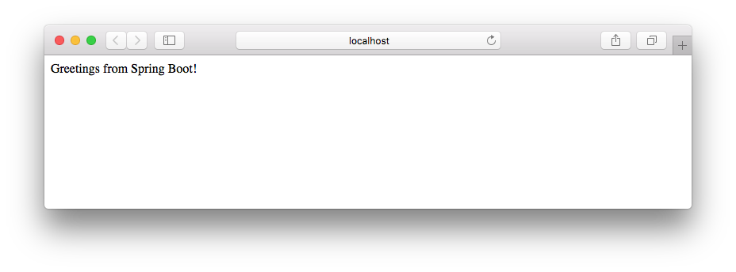

# SpringBoot

Aplicação Web com Spring

## Prérequisitos

1. Maven 3+
2. Java 8+

## Como rodar

1. Clone

	```
	git clone https://github.com/carolinedesousasantos/RentalCarSpringBoot
	```

2. Entre na pasta

	```
	cd RentalCarSpringBoot
	```

3. Execute 

	```
	mvn spring-boot:run -Dserver.port=8080
	
	```
	```


4. Por fim, acesse pelo navegador

	[http://localhost:8080](http://localhost:8080)

# Saída




## Referências

[Spring Boot Reference Guide](http://docs.spring.io/spring-boot/docs/current-SNAPSHOT/reference/htmlsingle/)

[SpringBoot Initializer](https://start.spring.io/)
